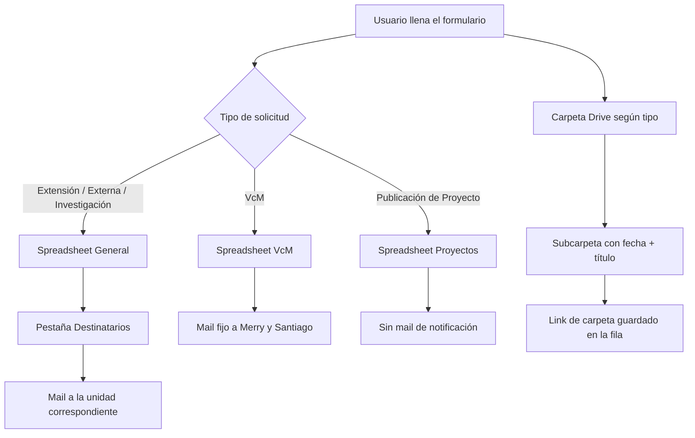
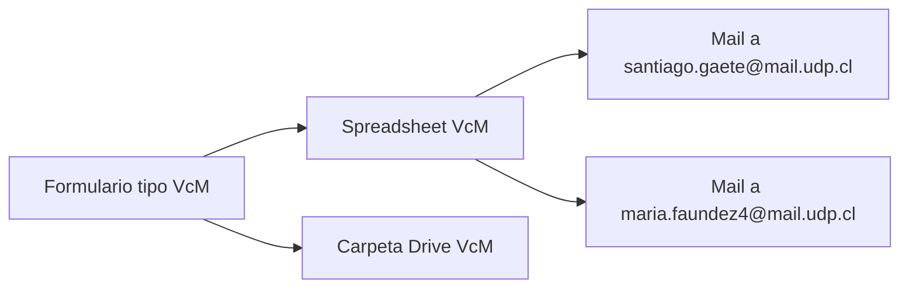
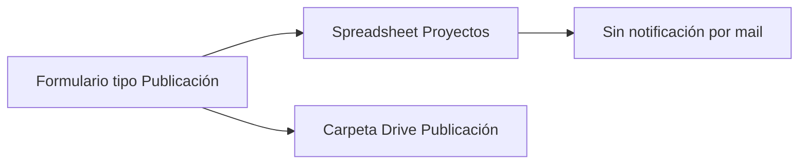
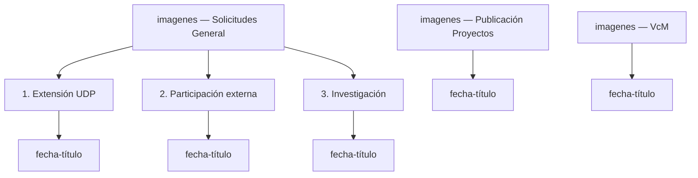

# Formulario de Actividades — FaAAD UDP

Formulario web (Google Apps Script) que recopila solicitudes de actividades de la Facultad de Arquitectura, Arte y Diseño (FaAAD) y las distribuye automáticamente a distintos spreadsheets, carpetas de Drive y correos según el tipo de solicitud.

## Tipos de solicitud

El formulario contempla 4 tipos de actividad:

| # | Tipo | Destino |
|---|------|---------|
| 1 | Iniciativas de Extensión Organizadas por UDP | Spreadsheet general |
| 2 | Participación en Instancias Externas | Spreadsheet general |
| 3 | Proyectos de Investigación, Creación e Innovación | Spreadsheet general |
| 4 | Registro de Actividades VcM | Spreadsheet VcM (independiente) |

> Existe además un quinto flujo, **Publicación de Proyecto**, integrado como una opción adicional del mismo formulario pero con un destino totalmente separado (ver sección [Publicación de Proyecto](#publicación-de-proyecto)).

## Arquitectura general

## Spreadsheet general (Extensión, Externa, Investigación)

Una sola pestaña general contiene las columnas para los 3 tipos. Cada bloque de columnas corresponde a un tipo de solicitud:

| Bloque | Columnas |
|---|---|
| **General** (aplica a todos) | ESTADO, Marca temporal, Dirección de correo electrónico, ¿Qué tipo de iniciativa quieres registrar? |
| **Extensión** | Organiza(n), Título de la actividad, Nombre del ciclo o proyecto al que pertenece, Descripción del evento o iniciativa, Participan o colaboran, Reseña de participantes e instituciones, Fecha y Hora, Lugar, Formato, Público objetivo, Cantidad de asistentes, Solicitud de apoyo gráfico |
| **Externa** | Organiza(n), Título, Descripción de la iniciativa, Participan o colaboran, Reseña de los participantes, Enlaces, Fecha y Hora (opcional), Lugar, Formato*, Público objetivo, Cantidad de asistentes, Imágenes, Adjuntar logos (no FAAD), Hipervínculos, Equipo técnico, Disposición de sala / auditorio, Cobertura fotográfica/filmación/transmisión, Solicitudes especiales |
| **Publicaciones académicas** (no aplica — fuera de responsabilidad) | Título, Capítulo de libro, Resumen/abstract, Año, País, ISBN/ISSN, Editorial o revista, Cita completa, DOI/URL, Indexación, Enlaces complementarios, Documento e imágenes, Comentarios adicionales, Título, Descripción, Biografía, Documentos e imágenes |
| **Investigación** | Título del proyecto, ¿Contó con financiamiento UDP?, Reseña, Financiamiento - Agencia, Financiamiento - Línea/Programa, Año de adjudicación, Año de inicio, Año de término, Monto adjudicado, Rol UDP, Investigador/a responsable, Colaboradores/equipo de trabajo, Imagen representativa |
| **No aplica** | Tipo de publicación, Link a aparición en prensa, Unidad FaAAD de la actividad, Unidad FaAAD asociada, Imágenes |

\* *En caso de ser online u híbrido es necesario tener la autorización de los invitados.*

### Envío de correos — Spreadsheet general

El mail no se envía a una dirección fija. En su lugar, se consulta la pestaña **Destinatarios** del mismo spreadsheet, que define a quién avisar según el tipo de solicitud y la unidad:

| Unidad | 1. Extensión UDP | 2. Participación externa | 3. Publicación académica | 4. Aparición en prensa | 5. Investigación |
|---|---|---|---|---|---|
| Arquitectura | | | | | |
| Arte | | | | | |
| **Diseño** | ✉️ | ✉️ | — *(no aplica)* | — *(no aplica)* | ✉️ |
| Facultad | | | | | |

El sistema lee la fila correspondiente a **Diseño** y manda el mail a la columna que corresponda al tipo de solicitud enviado.

## Registro de Actividades VcM

Flujo independiente, con su propio spreadsheet y reglas de notificación fijas.

- **No** pasa por la pestaña de Destinatarios.
- El mail siempre llega a los mismos dos correos, sin importar la unidad.

## Publicación de Proyecto

Un quinto tipo de solicitud, separado del flujo FaAAD. Pensado para que estudiantes, docentes, egresados, etc. suban proyectos que eventualmente se publican en la web de Diseño UDP.

> No es responsabilidad del flujo de "Publicaciones académicas" mencionado en el spreadsheet general — son cosas distintas con nombres parecidos.

## Estructura de carpetas en Drive

Cada tipo de solicitud sube sus archivos a una carpeta raíz distinta, y dentro de ella organiza por sub-tipo y luego por fecha + título:

El link de cada carpeta se guarda automáticamente en la fila correspondiente del spreadsheet (cuando hay columna disponible para ello).

## Recursos y enlaces

| Recurso | Destino | Enlace / ID |
|---|---|---|
| Spreadsheet general (Extensión, Externa, Investigación) | Pestaña general + Destinatarios | `18EUt_wauhDenkEmjawYFDDZ7XYgLmSiIQmonL4LVRIA` |
| Spreadsheet VcM | Registro-VcM | `1mssLeTJuhg49QZPdkB7zQZO78p5AuA6J71hX302aciw` |
| Spreadsheet Proyectos (Publicación) | Proyectos | `1Y_pmmK7_d_mQAK3xOXO9k0ADidAzcqXbBcZnTqEmdks` |
| Carpeta Drive — Solicitudes General | `imagenes` | `1Qd9rSijCviNjZU6j7IeekKv-L56TWTm5` |
| Carpeta Drive — Publicación de Proyectos | `imagenes` | `1_QqPOgXPq5u2xjR3NdJql7as17hcLyFj` |
| Carpeta Drive — VcM | `imagenes` | `1fuYLDH2Vhsix5i0fEAMFzLydDd6E-Y_b` |

## Pendientes / notas de implementación

- Verificar permisos de la cuenta oficial (VcM) sobre todos los spreadsheets y carpetas: cada recurso debe compartirse explícitamente con esa cuenta, no basta con moverlo a una carpeta compartida.
- Confirmar columna E (Aparición en prensa) en la pestaña Destinatarios — actualmente no tiene un tipo de solicitud asociado en el formulario.
- Mail de confirmación al responsable ("Gracias por completar el formulario") implementado para todos los tipos.
